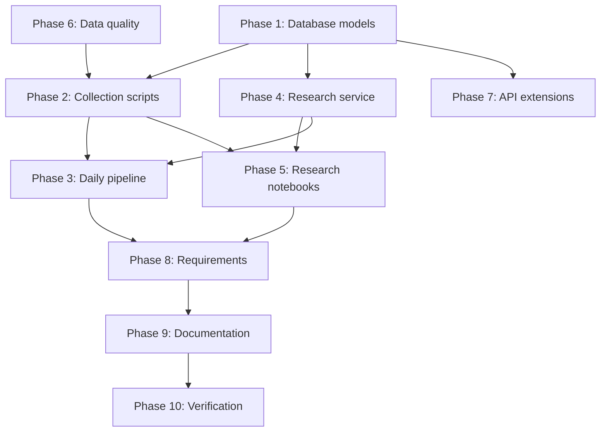

# Historical Research Pipeline — Implementation Plan

Extend the existing StockResearch dashboard into a full behavioral finance research platform with persistent storage, automated data collection, forward return computation, correlation analysis, and event study notebooks.

> [!IMPORTANT]
> The existing frontend and backend remain fully functional. All new work is additive — no existing endpoints, services, or frontend components are modified in breaking ways.

## User Review Required

> [!WARNING]
> **Stock universe is NSE-focused.** The five symbols (`RELIANCE.NS`, `TCS.NS`, `INFY.NS`, `HDFCBANK.NS`, `ICICIBANK.NS`) and the benchmark `^NSEI` (Nifty 50) are hard-coded in scripts but configurable via a `SYMBOLS` list. Let me know if you want more symbols or a different benchmark.

> [!IMPORTANT]
> **SQLite is single-writer.** This is fine for local research but will not support concurrent pipeline runs. The plan uses SQLAlchemy so migrating to PostgreSQL later is a one-line change.

> [!IMPORTANT]
> **Jupyter notebooks (.ipynb) cannot be edited by tools.** I will create them as runnable Python scripts (`correlation_analysis.py`, `event_study.py`) inside `backend/research/` and also provide a helper script to convert them to `.ipynb` via `jupytext`. Alternatively, I can generate the `.ipynb` JSON directly. Let me know your preference.

## Open Questions

1. **yfinance news API** — `Ticker.news` was deprecated in recent yfinance versions and may return empty results for NSE stocks. The plan uses Google News RSS as the primary source and includes a yfinance news fallback that gracefully degrades. Is this acceptable, or do you want a different secondary source?
2. **Historical depth** — yfinance provides ~2 years of daily data for NSE stocks with the free tier. For the stock_prices table, do you want `max` history or a specific lookback (e.g., 5 years)?
3. **Model download** — FinBERT (`ProsusAI/finbert`) is ~440MB. The first `collect_news.py` run will download it. This is already working from the previous fix.

---

## Proposed Changes

### Phase 1 — Database Layer

New package: `backend/database/`

#### [NEW] [database.py](file:///d:/StockResearch/backend/database/database.py)
- SQLAlchemy engine pointing to `backend/database/stocks.db`
- `SessionLocal` factory with `expire_on_commit=False`
- `get_db()` context manager for session lifecycle
- `init_db()` function that calls `Base.metadata.create_all()`
- Automatic table creation on import

#### [NEW] [models.py](file:///d:/StockResearch/backend/database/models.py)
- `Base = declarative_base()`
- **`NewsSentiment`** model:
  - `id` (Integer, PK, autoincrement)
  - `symbol` (String, indexed)
  - `headline` (String)
  - `cleaned_headline` (String)
  - `source` (String, default `"google_news_rss"`)
  - `published_at` (DateTime, timezone-aware)
  - `sentiment_label` (String: positive/negative/neutral)
  - `sentiment_confidence` (Float)
  - `sentiment_score` (Float: +conf / 0 / -conf)
  - `created_at` (DateTime, server default `utcnow`)
  - **UniqueConstraint** on `(symbol, headline, published_at)` to prevent duplicate headlines
- **`StockPrice`** model:
  - `id` (Integer, PK, autoincrement)
  - `symbol` (String, indexed)
  - `date` (Date)
  - `open`, `high`, `low`, `close` (Float)
  - `volume` (BigInteger)
  - `rsi`, `macd`, `macd_signal`, `macd_histogram` (Float, nullable)
  - **UniqueConstraint** on `(symbol, date)`
- **`ResearchMetric`** model:
  - `id` (Integer, PK, autoincrement)
  - `symbol` (String, indexed)
  - `date` (Date)
  - `sentiment_score` (Float)
  - `future_return_1d`, `future_return_3d`, `future_return_7d`, `future_return_30d` (Float, nullable)
  - `abnormal_return_1d`, `abnormal_return_7d` (Float, nullable)
  - **UniqueConstraint** on `(symbol, date)`

#### [NEW] [\_\_init\_\_.py](file:///d:/StockResearch/backend/database/__init__.py)
- Exports `SessionLocal`, `init_db`, `get_db`, and all models

---

### Phase 2 — Historical Data Collection Scripts

New package: `backend/scripts/`

#### [NEW] [config.py](file:///d:/StockResearch/backend/scripts/config.py)
- `SYMBOLS = ["RELIANCE.NS", "TCS.NS", "INFY.NS", "HDFCBANK.NS", "ICICIBANK.NS"]`
- `BENCHMARK = "^NSEI"`
- `HISTORY_PERIOD = "5y"`
- Logging configuration

#### [NEW] [collect_news.py](file:///d:/StockResearch/backend/scripts/collect_news.py)
- For each symbol:
  1. Fetch headlines via Google News RSS (reuse existing `news_service.fetch_news_headlines`)
  2. Attempt yfinance `Ticker(symbol).news` as fallback
  3. Clean headlines (reuse existing `cleaning_service.clean_headline`)
  4. Run FinBERT sentiment (reuse existing `finbert_service.analyze_sentiment`)
  5. Upsert into `news_sentiment` table (skip duplicates via unique constraint + `INSERT OR IGNORE`)
- Log: symbols processed, articles found, new vs skipped, errors
- Safe re-run: duplicate headlines are silently skipped

#### [NEW] [collect_stock_data.py](file:///d:/StockResearch/backend/scripts/collect_stock_data.py)
- For each symbol + benchmark:
  1. Download OHLCV via `yfinance.download(period=HISTORY_PERIOD)`
  2. Compute RSI, MACD, MACD signal, MACD histogram (reuse existing `stock_data.add_indicators`)
  3. Upsert into `stock_prices` table (skip existing dates via unique constraint)
- Log: symbols processed, rows inserted, rows skipped

#### [NEW] [build_research_dataset.py](file:///d:/StockResearch/backend/scripts/build_research_dataset.py)
- Join `news_sentiment` and `stock_prices` tables
- For each sentiment date per symbol:
  1. Look up closing price on sentiment date
  2. Look up closing prices at t+1, t+3, t+7, t+30
  3. Compute future returns: `(P_t+n - P_t) / P_t`
  4. Look up benchmark returns for same windows
  5. Compute abnormal returns: `stock_return - market_return`
  6. **Look-ahead bias prevention**: only uses prices *after* the sentiment date
  7. **After-market handling**: if sentiment is published after market close, use next trading day as t=0
  8. **Weekend handling**: use next available trading day for all lookups
- Upsert results into `research_metrics` table
- Log: records computed, missing price data skipped

---

### Phase 3 — Daily Automated Pipeline

#### [NEW] [run_daily_pipeline.py](file:///d:/StockResearch/backend/scripts/run_daily_pipeline.py)
- Orchestrator script that runs the full pipeline:
  ```
  1. collect_news.py      → Fetch & score headlines
  2. collect_stock_data.py → Fetch & store prices
  3. build_research_dataset.py → Compute forward returns
  ```
- Each step wrapped in try/except with logging
- Summary stats printed at end
- Exit code reflects success/failure
- Safe re-run: all sub-steps are idempotent

#### [NEW] [scheduler_examples.md](file:///d:/StockResearch/backend/scripts/scheduler_examples.md)
- Windows Task Scheduler XML example
- Linux cron example
- Python `schedule` library example

---

### Phase 4 — Research Service

#### [NEW] [research_service.py](file:///d:/StockResearch/backend/services/research_service.py)
- `compute_future_returns(symbol, sentiment_date, prices_df)` → dict of 1d/3d/7d/30d returns
- `compute_abnormal_returns(stock_returns, benchmark_returns)` → dict of 1d/7d abnormal returns
- `get_next_trading_day(date, prices_df)` → handles weekends and holidays
- `align_sentiment_to_market(published_at)` → shifts after-hours sentiment to next trading day
- All functions have docstrings explaining the finance logic and bias prevention

---

### Phase 5 — Research Notebooks

New directory: `backend/research/`

#### [NEW] [correlation_analysis.py](file:///d:/StockResearch/backend/research/correlation_analysis.py)
Jupytext-compatible Python script (can be opened as notebook in Jupyter):
1. **Data loading** — Read `research_metrics` from SQLite into pandas
2. **Descriptive statistics** — Summary stats for sentiment scores and future returns
3. **Pearson correlation** — Sentiment vs future returns (1d, 3d, 7d, 30d)
4. **Spearman correlation** — Same pairs (rank-based, robust to outliers)
5. **Sentiment vs abnormal returns** — Pearson + Spearman
6. **Visualizations**:
   - Scatter plots: sentiment_score vs future_return_7d (color by symbol)
   - Correlation heatmap: all numeric columns
   - Rolling sentiment chart: 30-day moving average per symbol
   - Return distribution histograms: by sentiment tercile
7. All plots use `matplotlib` + `plotly` for interactive versions

#### [NEW] [event_study.py](file:///d:/StockResearch/backend/research/event_study.py)
Jupytext-compatible Python script:
1. **Event classification**:
   - Strong Negative: sentiment < -0.7
   - Neutral: -0.2 ≤ sentiment ≤ 0.2
   - Strong Positive: sentiment > 0.7
2. **Group statistics**:
   - Mean future return (1d, 3d, 7d, 30d) per group
   - Volatility (std dev) per group
   - Average abnormal return per group
   - Cumulative returns per group
3. **Statistical testing** (scipy + statsmodels):
   - Independent t-tests: negative vs positive groups
   - Welch's t-test for unequal variances
   - p-values and 95% confidence intervals
   - Test: "Do negative sentiment days significantly outperform positive sentiment days?"
4. **Visualizations**:
   - Box plots: future returns by sentiment group
   - Cumulative abnormal return (CAR) plots over event windows
   - Event window timeline: [-5, +30] trading days
   - Mean return comparison bar charts with error bars

---

### Phase 6 — Data Quality Module

#### [NEW] [data_quality.py](file:///d:/StockResearch/backend/services/data_quality.py)
- `deduplicate_headlines(articles)` — Remove exact and near-duplicate headlines
- `normalize_timezone(dt, target_tz="Asia/Kolkata")` — Normalize all timestamps to IST
- `align_to_market_hours(published_at)` — If after 15:30 IST, shift to next trading day
- `is_trading_day(date)` — Check against NSE calendar (weekends + known holidays)
- `get_next_trading_day(date)` — Skip weekends and holidays
- `handle_missing_values(df, strategy="forward_fill")` — Fill gaps in price data

---

### Phase 7 — API Extensions

#### [MODIFY] [main.py](file:///d:/StockResearch/backend/main.py)
- Add new endpoints (additive, existing endpoints unchanged):
  - `GET /research/metrics/{symbol}` — Return research_metrics from DB
  - `GET /research/correlation` — Return pre-computed correlation results
  - `GET /research/pipeline/status` — Return last pipeline run stats
- Import database `init_db` and call on startup via `@app.on_event("startup")`

---

### Phase 8 — Requirements & Dependencies

#### [MODIFY] [requirements.txt](file:///d:/StockResearch/backend/requirements.txt)
Add new packages:
```
sqlalchemy
scipy
statsmodels
matplotlib
plotly
jupyter
jupytext
pytz
```
Note: `sqlite3` is part of Python stdlib, no pip install needed.

---

### Phase 9 — Documentation

#### [MODIFY] [PROGRESS.md](file:///d:/StockResearch/PROGRESS.md)
- Add Phase 2: Research Infrastructure section with all new components
- Update architecture diagram
- Track completion status for each sub-phase

#### [MODIFY] [README.md](file:///d:/StockResearch/README.md)
- Add database setup section
- Add daily pipeline usage section
- Add notebook usage section
- Add research methodology section
- Update project structure diagram

---

## Verification Plan

### Automated Tests
1. **Database creation**: Run `init_db()` and verify all three tables exist in `stocks.db`
2. **Collection scripts**: Run each script for a single symbol and verify rows in DB
3. **Pipeline**: Run `run_daily_pipeline.py` and verify end-to-end data flow
4. **Duplicate safety**: Run pipeline twice, verify no duplicate rows
5. **Research computation**: Verify future return formula against manual calculation
6. **Existing endpoints**: Hit `/stock/RELIANCE` and `/sentiment/RELIANCE` to confirm no regression

### Manual Verification
1. Open Jupyter and run both research notebooks
2. Verify visualizations render correctly
3. Verify statistical tests produce p-values
4. Check frontend still works end-to-end

## Execution Order



Phases 1 and 6 are built first (foundational). Then Phases 2 and 4 (data collection + computation). Then Phase 3 (pipeline orchestrator). Then Phase 5 (notebooks). Finally Phases 7-9 (API, deps, docs).
